# Дипломная работа

## Цель работы: составить документацию процессов ETL на основе датасета [Supermarket](https://www.kaggle.com/aungpyaeap/supermarket-sales?select=supermarket_sales+-+Sheet1.csv)


### Этапы выполнения дипломной работы
* Обработать и проанализировать данные из датасета
* Сформировать нормализованную схему данных (`NDS`)
* Сформировать состав таблиц фактов и измерений (`DDS`)
* Сформировать `ETL`-процессы: для заливки данных в `NDS` и для создания витрин
* Сформировать набор метрик и дашбордов на их основе
* Оформить результаты, сформулировать выводы

# Инструменты для выполнения задания
  * [PostgreSQL](https://www.postgresql.org/) - для хранения данных. Развернута в облаке [`VK Cloud`](https://mcs.mail.ru/)
  * [Python](https://www.python.org/) - для описания `dag`, `dbt`
  * [Jupyter Notebook](https://jupyter.org/) - инструмент анализа данных
  * [dbt](https://docs.getdbt.com/) - инструмент формирования sql запросов и автоматического документирования объектов хранилища данных
  * [Airflow](https://airflow.apache.org/) - для оркестрации ETL
  * [Docker, docker-compose](https://www.docker.com/) - развертывание локальной БД (dev+test), airflow окружения
  * [git](https://git-scm.com/) - для версионирования
  * [Github pages](https://pages.github.com/) + `dbt-docs`
  * [DataLens](https://datalens.yandex.ru/) - для создания дашбордов
  * Облачные техонологии `DBaaS` - `Database-as-a-service`


# Этап 1. Обработка и анализ данных из датасета Supermarket
Этап 1. описан в jupyter notebook [step1_analysis.ipynb](step1_analysis.ipynb)
В нём:
* Выполнен анализ данных `Supermarket`
* Переименованы заголовки полей датасета
* Создан класс адаптера для БД для осуществления базовых функций работы с БД
* Подгружены "сырые" (`raw`) данные в БД
* В промышленных условиях "сырые" данные из разных систем попадают в хранилище с помощью специальных `ETL-процессов`. Для таких процесоов могут быть использованы разные способы доставки сырых данных, например с помощью шины данных [Apache Kafka](https://kafka.apache.org/).

# Этап 2. Формирование схемы звезда в NDS и DDS

`NDS` - **normalized data store**. Хранилище нормализованных данных — это внутреннее хранилище основных данных в форме одной или нескольких нормализованных реляционных баз данных с целью интеграции данных из различных исходных систем.

`DDS` - **detail data store**. Представляет собой доступное пользователю хранилище данных в виде одной или нескольких реляционных баз данных, где данные расположены в многомерном формате для поддержки аналитических запросов.

## Общее описание модели данных

Модель потоков данных (**`Linage`**):
  * `Raw` - данные из систем источников
  * `Staging` - слой предобработанных и очищенных данных
  * `NDS` - данные в 3й нормальной форме, в схеме звезда
  * `DDS` - слой данных для BI систем

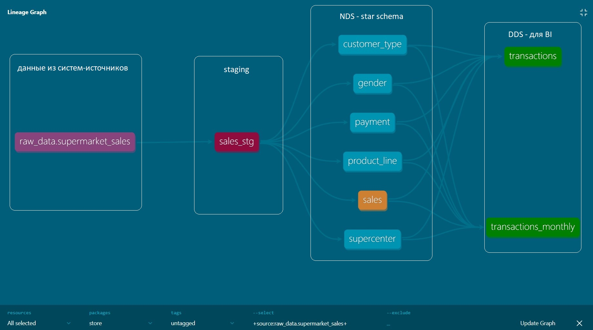

## Состав таблиц по схемам в БД:

Описание всех таблиц доступно в самогенерирующейся с помощью [`dbt`](https://docs.getdbt.com/) документации к [DWH Superstore](https://grant88.github.io/#!/overview)
Эта документация доступна по [ссылке](https://grant88.github.io/).

Содержание документации:

* `raw`
  * [supermarket_sales](https://grant88.github.io/#!/source/source.store.raw_data.supermarket_sales)
* `store` Объекты в схеме логически разбиты на предназначения таблиц:
  * `staging`
    * [sales_stg](https://grant88.github.io/#!/model/model.store.sales_stg)
  * `sales`
    * [sales](https://grant88.github.io/#!/model/model.store.sales)
  * `dim` - **dimensions**, измерения или справочники
    * [customer_type](https://grant88.github.io/#!/model/model.store.customer_type)
    * [payment](https://grant88.github.io/#!/model/model.store.gender)
    * [product_line](https://grant88.github.io/#!/model/model.store.product_line)
    * [supercenter](https://grant88.github.io/#!/model/model.store.supercenter)
    * [gender](https://grant88.github.io/#!/model/model.store.gender)
  * `bi` **marts**, витрины данных для `BI-систем`
    * [transactions](https://grant88.github.io/#!/model/model.store.transactions)
    * [transactions_monthly](https://grant88.github.io/#!/model/model.store.transactions_monthly)

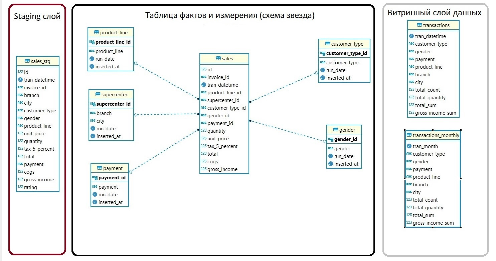


# Этап3. ETL-процессы: для заливки данных в NDS и для создания витрин

В данной работе вместо `ETL` используется `ELT` процесс. 
* Сначала данные извлекаются из систем-поставщиков информации - **Extract**
* Потом эти данные загружаются в сыром (raw) виде как есть в хранилище - **Load**.
* Затем данные трансформируются с помощью `dbt` - **Transform**.

Запуск ELT процесса происходит каждый день с помощью `Apache airlfow`

`DAG` этого процесса находится в файле [insert.py](./airflow/dags/insert.py). В этом даге с помощью оператора `BashOperator` запускается процесс трансформации данных с использованием `dbt`.

Для запуска Airflow в контейнере используется образ `apache/airflow:2.4.2` c [Dockerhub](https://hub.docker.com/):

```powershell
docker pull apache/airflow:2.4.2
```

На его основе создается свой докер-образ `apache/airflow_dbt:2.4.2` в который также доустанавливается `dbt`. Описание этого образа находится в файле [Dockerfile](./airflow/Dockerfile)

```powershell
cd airflow
docker build -t apache/airflow_dbt:2.4.2 .
```

После создания образа запускается `airflow` и его сервисы с помощью `docker-compose`. Конфигурация запуска находится в [docker-compose.yaml](./airflow/docker-compose.yaml)

```powershell
docker-compose up airflow-init
docker-compose up
```

Для работы `dbt` предварительно настраивается конфигурационный файл [profiles.yml](./airflow/dags/dbt/store/profiles.yml) в котором указываются данные для подключения к БД хранилища. БД хранилища может быть развернута как в облаке так и локально.

Пример заполнения файла `profiles.yml`:
```yml
store:
  outputs:

    dev:
      type: postgres
      threads: 1
      host: localhost
      port: 5432
      user: netology
      pass: netology
      dbname: netology
      schema: store

    prod: # указываются вводные продакшн БД
      type: postgres
      threads: 1
      host: localhost
      port: 5432
      user: netology
      pass: netology
      dbname: netology
      schema: store

  target: prod
```

В контейнере `airflow-scheduler` файл конфигурации `dbt` подключений `profiles.yml` доступен по пути `/opt/airflow/dags/dbt/store/profiles.yml` поскольку каталог
`./airflow/dags` в контейнере монтируется как `volume` в каталог `/opt/airflow/dags`


### После запуска `Apache airflow` в `Web UI` активируется DAG `store`:

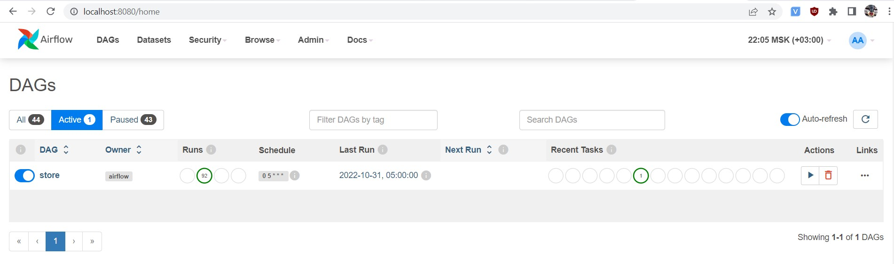

### После активации DAG `store` процесс будет итеративно за каждый день наполнять хранилище данных:
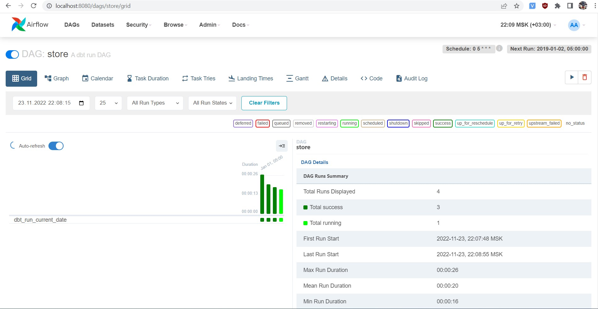

### Календарь ежедневного наполнения данных выглядит следующим образом:
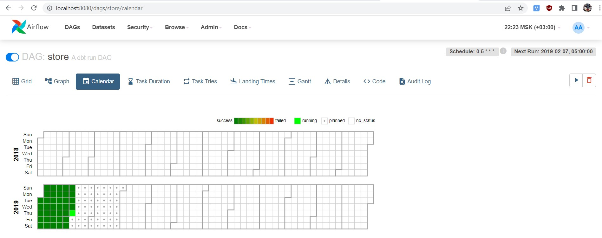

### Во время первого запуска `dbt` на основании `sql-выражений` создаст таблицы в схеме `store` в БД:
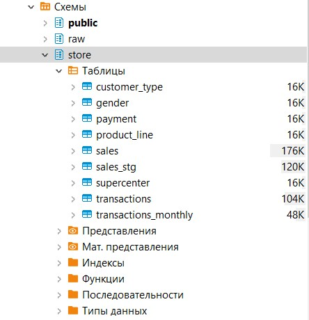

Во время последующих итеративных запусков `dbt` уже не будет создавать эти таблицы, а будет их итеративно дополнять

Этот процесс будет актуален для таблицы фактов `sales`, стейджинговой витрины `sales_stg`, BI-витрины `transactions` а также для всех таблиц-измерений:
  * [customer_type](https://grant88.github.io/#!/model/model.store.customer_type)
  * [payment](https://grant88.github.io/#!/model/model.store.gender)
  * [product_line](https://grant88.github.io/#!/model/model.store.product_line)
  * [supercenter](https://grant88.github.io/#!/model/model.store.supercenter)
  * [gender](https://grant88.github.io/#!/model/model.store.gender)

Поэтому эти таблицы объединены общим свойством `incremental`:
```sql
{{
    config(
        materialized='incremental'
    )
}}
```
На основании этой настройки `dbt` в свой первый запуск по расписаню создает таблицы с данными, в последующие запуски по расписанию дополняет их инкрементально.


# Этап 4. Формирование витринного слоя данных

Витринный слой данных для BI-систем состоит из двух таблиц-витрин:
* [transactions](https://grant88.github.io/#!/model/model.store.transactions)
* [transactions_monthly](https://grant88.github.io/#!/model/model.store.transactions_monthly)

Витирну [transactions_monthly](https://grant88.github.io/#!/model/model.store.transactions_monthly) отличает свойство материализации `table`
```sql
{{
    config(
        materialized='table'
    )
}}
```
Это свойство материализации витрины позволяет пересоздавать её данных каждый раз с появлением новых данных. Это бывает актуально например для неаддитивных метрик, которые должны отражать полные данные за неполный месяц, при условии, что витрина - по месяцам.

# Этап 5. Набор метрик и дашбордов на их основе

Дашборд [Supermarket](https://datalens.yandex/qahn81vmdoeyh) создан при помощи сервиса визуализации [DataLens](https://datalens.yandex/).

Метрики:
* Сумма дохода по месяцам и продуктовым линейкам
* Сумма покупок по дням
* Топ филиалов по доходу за всё время 

Дашборд `Supermarket` доступен по публичной [ссылке](https://datalens.yandex/qahn81vmdoeyh)

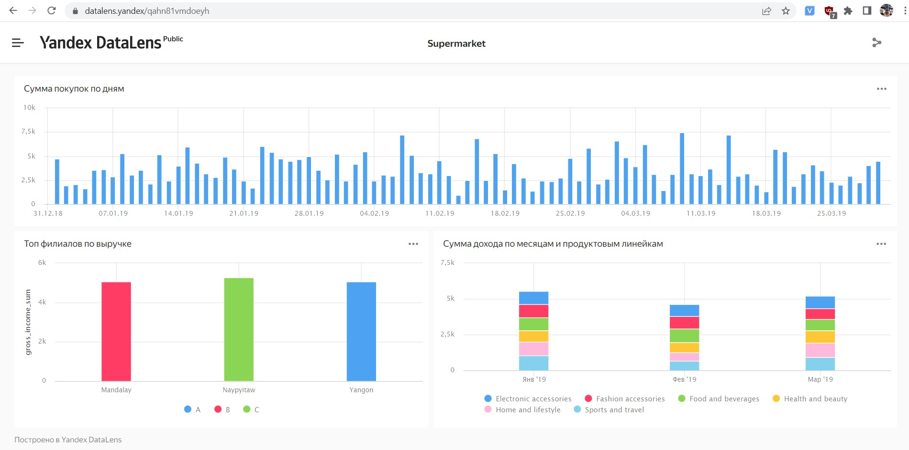

Выбор пал на этот инструмент сервиса визуализации и анализа данных потому что:
* он бесплатный
* без ограничений на количество пользователей и запросов
* сейчас [Tableau](https://mkt.tableau.com/no_service.html) не доступен на рынке РФ:

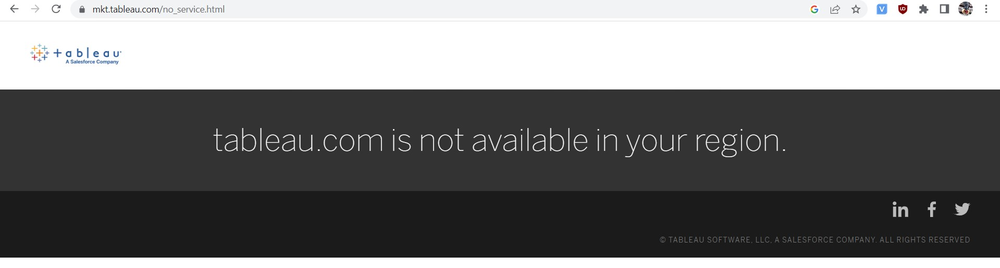

# Этап 6. Документация объектов хранилища данных

Документация хранилища опубликована по адресу: https://grant88.github.io

Она формируется автоматически с помощью утилиты `dbt docs` на основании метаданных, описанных в файлах: 
* [staging_schema.yml](./airflow/dags/dbt/store/models/staging/staging_schema.yml)
* [dim_schema.yml](./airflow/dags/dbt/store/models/staging/dim_schema.yml)
* [marts_schema.yml](./airflow/dags/dbt/store/models/staging/marts_schema.yml)
* [bi_schema.yml](./airflow/dags/dbt/store/models/staging/bi_schema.yml)

## Использование этого инструмента позволяет:
* автоматически генерировать документацию
* запускать вебсервер с документацией
* отображать на вебстраницах:
  * общее описание хранилища, в нашем случае - `Supermarket store`
  * comments к объектам хранилища, в том числе автоматически оставлять `COMMENT` на колонке в объекте БД
  * comments к колонкам таблиц хранилища, в том числе автоматически оставлять `COMMENT` на колонке в объекте БД
  * взаимосвязи объектов - `linage`
  * типы данных столбцов объектов
  * тесты `Data Quality`, например
    * `unique`
    * `not null`
  * `sql-скрипты`, которые показывают трансформации в ELT в двух видах:
    * в конечном виде (compiled)
    * в виде шаблона `jinja` (templated)

### Формат файлов описания метаданных:
```yml
version: 2

models: # перечисляются логически объединненые таблицы, например, таблицы фактов
  - name: sales # наименование таблицы
    description: > # описание таблицы, будет также отражено в DDL комментариях к таблице
      This is sales main fact table 
    docs: # цвет таблицы на схемах с linage
      node_color: "#cd7f32"
    columns: # перечисляются все столбцы объекта
      - name: id
        description: incremental id # будет отражено также в DDL комментариях к столбцу таблицы
        tests: # базовые тесты Data Quality, также можно сюда указать custom tests
          - unique # проверка данных в столбце на униклаьность
          - not_null # проверка того, что нет NULL значений в столбце
      - name: invoice_id
        description: '{{ doc("invoice_id") }}' # описание для общего атрибута можно задать один раз, и использвать для в других таблицах
        tests:
          - unique
          - not_null
```

Для ее запуска необходимо выполнить:
```bash
dbt docs generate
```
Метаданные появляются в каталоге `target` в домашнем каталоге `dbt`- проекта: `/opt/airflow/dbt/store/target`

После этого остается перенести данные из каталога `target` на хостинг, либо локально запустить вебсервер:
```bash
dbt docs serve --port 8001
```

В данной работе в качестве хостинга для документации использован сервис [GitHub Pages](https://pages.github.com/)

## Рассмотрим на примере одного объекта БД - таблицы фактов `sales`, что отображает документация:


### Можно увидеть `SQL` код для трансформаций в ELT-процессе:
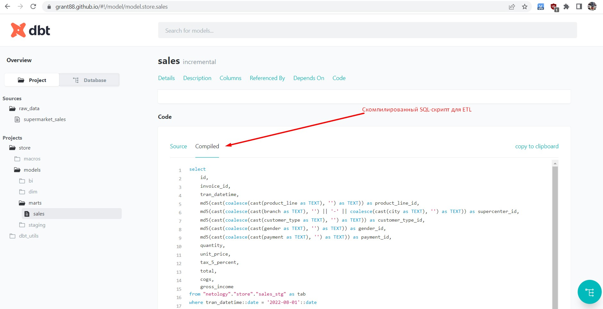

### Описание тестов `Data Quality`, constraints, зависимостей:
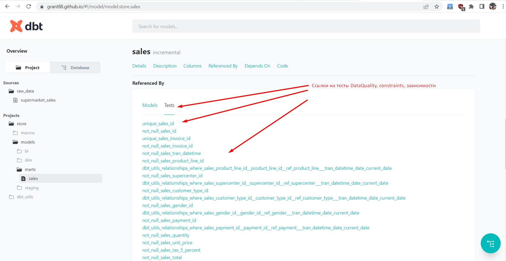

### Также можно отследить трансформации данных от самого источника:
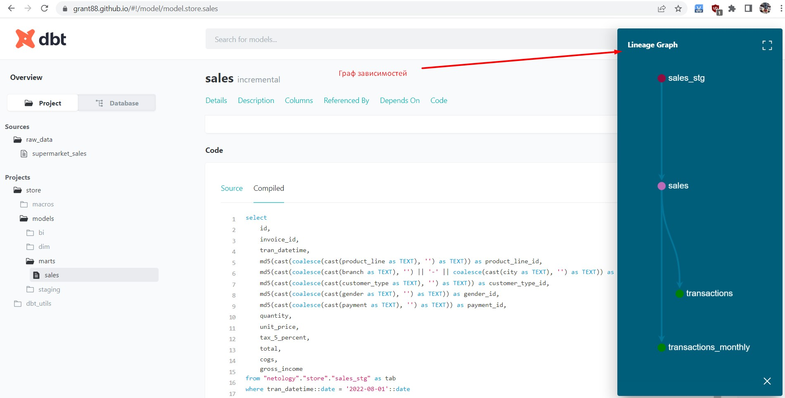

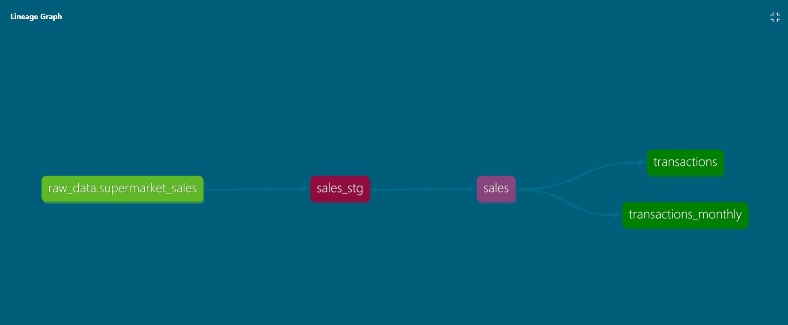

# Выводы

* В работе был использован датасет [Supermarket](https://www.kaggle.com/aungpyaeap/supermarket-sales?select=supermarket_sales+-+Sheet1.csv). Он был проанализирован и подгружен в БД. Предварительно БД была поднята в облаке. 
* Софрмирована и описана модель данных, на основании которых были созданы `staging`, `dimensioin`, слои данных и таблица фактов по типу схемы звезда. 
* Был настроен `ELT-процесс`, который инкрементально ежедневно подгружает новые порции данных в хранилище.
* Автоматически сформирована [документация](https://grant88.github.io) и опубликована на общедоступном в интеренете ресурсе. 
* Выбраны метрики и на основании них сформирован [дашборд](https://datalens.yandex/qahn81vmdoeyh) с графиками. Дашборд автоматически обновляется и опубликован в интернете.